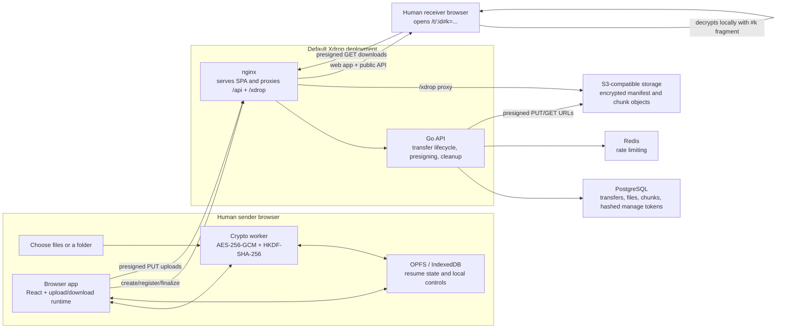

<p align="center">
  
</p>

<p align="center">
  <a href="https://codecov.io/github/xixu-me/xdrop">
    
  </a>
  <a href="https://github.com/xixu-me/xdrop/actions/workflows/ci.yml">
    
  </a>
  <a href="https://github.com/xixu-me/xdrop/actions/workflows/github-code-scanning/codeql">
    
  </a>
  <a href="https://ghcr.io/xixu-me/xdrop">
    
  </a>
</p>

> [!TIP]
> 欢迎加入“Xget 开源与 AI 交流群”，一起交流开源项目、AI 应用、工程实践、效率工具和独立开发；如果你也在做产品、写代码、折腾项目或者对开源和 AI 感兴趣，欢迎[**进群**](https://file.xi-xu.me/QR%20Codes/%E7%BE%A4%E4%BA%8C%E7%BB%B4%E7%A0%81.png)认识更多认真做事、乐于分享的朋友。

<p align="center">
  English | <a href="./README.zh.md">汉语</a>
</p>

Xdrop is an open source end-to-end encrypted file transfer app for humans and agents, keeping
plaintext file names, contents, and keys off the server.

## Highlights

- End-to-end encrypted file transfer for direct browser sharing and agent-driven handoffs.
- Single-file and folder transfers, including local ZIP downloads for received folders.
- Resumable uploads with local staged state for interrupted web transfers.
- Expiring links, sender-side management, and optional privacy mode after upload.
- S3-compatible object storage support with PostgreSQL and Redis on the backend.

## Screenshots

<p align="center">
  
</p>

Agents can directly encrypt and upload local files or folders to generate a share link, or download and decrypt files locally using an existing link.

<p align="center">
  
</p>

Humans can also open the share link directly in a browser to decrypt and download the files locally.

## Use Via Agents

Agents can use Xdrop to upload files, return end-to-end encrypted share links, and use Xdrop
links for local decryption.

Install the companion skill:

```bash
bunx skills add xixu-me/skills -s xdrop
```

After that, the agent can use Xdrop from the terminal to:

- Upload local files or directories and return an encrypted share link.
- Download a full Xdrop share link, including `#k=...`, and decrypt it locally.
- Automate repeatable handoff flows without relying on the browser UI.

Example prompts:

- `Upload ./dist to https://xdrop.example.com and give me a 1-hour Xdrop link.`
- `On this VM, send /var/log/myapp through Xdrop so I can inspect it locally.`
- `Download this Xdrop link into ~/downloads and keep the original folder structure.`

## How It Works

For browser-based sharing, the core lifecycle works like this. Agents use the same encrypted
transfer format and full share links for terminal uploads and local decryption.

1. A sender creates a transfer in the browser. Xdrop generates a random transfer root key and a
   separate link key, optionally strips removable image metadata, and prepares resumable local
   state before upload begins.
2. The API creates the transfer record and returns a manage token plus upload limits. The browser
   registers encrypted file metadata, then requests presigned chunk upload URLs in batches.
   PostgreSQL stores transfer/file/chunk metadata, Redis enforces rate limits, and S3-compatible
   storage keeps only encrypted blobs.
3. The sender shares a full link such as `/t/:transferId#k=...`. The `#k=...` fragment stays in
   the browser and is used to unwrap the transfer root key locally.
4. During upload, file chunks are encrypted in a dedicated Web Worker and streamed to storage.
   After every chunk is uploaded, the browser encrypts the manifest, uploads it, and finalizes the
   transfer with the wrapped root key.
5. A recipient opens the link, fetches the encrypted manifest and chunk URLs, and decrypts the
   transfer entirely in the browser. Folder downloads can be re-packed into a ZIP locally.
6. Background cleanup periodically removes expired or deleted transfer objects from storage.

Xdrop keeps plaintext file names, paths, contents, and decryption keys off the server. The server
still sees operational metadata such as transfer timestamps, file counts, chunk counts, file
sizes, and rate-limit identifiers.

Key technical details:

- **Crypto model:** The client generates 32-byte random secrets for the transfer
  root key and the share-link key. HKDF-SHA-256 derives separate AES-256-GCM keys for the
  manifest and for each file, and chunk encryption binds `transferId`, `fileId`, `chunkIndex`,
  size, and protocol version as authenticated data.
- **Chunked uploads:** The server advertises chunk size, file-count, and transfer-size limits to
  the upload client. This repo defaults to 8 MiB chunks, up to 100 files, and a 256 MiB
  encrypted transfer size cap.
- **Resume behavior:** Xdrop persists source files locally in OPFS when available and falls back
  to IndexedDB-backed blobs when the staged data is still within the fallback storage limit.
  Resume requests ask the API which chunks already exist so the active client only uploads missing
  work after a refresh or reopen.
- **Sender controls:** The manage token is returned once on creation and stored as a SHA-256 hash
  on the server. Privacy mode can scrub sender-side local controls after upload.
- **Backend responsibilities:** The API never decrypts payloads. It validates transfer state,
  rate-limits endpoints, issues presigned URLs, stores metadata, and cleans up expired or deleted
  objects from storage.

## System Architecture

The default deployment below shows the human browser flow. Agents interact with the same API and
share-link format for terminal uploads and local decryption.



In the default Docker deployment, nginx serves the built frontend and proxies both `/api` and
`/xdrop`. If `S3_PUBLIC_ENDPOINT` points at a different public object-storage endpoint, presigned
upload and download requests can bypass the nginx proxy while the rest of the architecture stays
the same.

## Deployment

### Recommended Production Topology

For a public deployment, run Xdrop behind a reverse proxy such as Caddy or nginx:

- The reverse proxy terminates HTTPS for your public domain.
- The `xdrop` container listens on a loopback-only host port such as `127.0.0.1:8080`.
- MinIO should not be exposed publicly. Bind MinIO ports to `127.0.0.1` only unless you have
  a specific reason to expose them.
- Set `S3_PUBLIC_ENDPOINT` and `ALLOWED_ORIGINS` to your public site URL, for example
  `https://xdrop.example.com`.

### Step 1: Get the Files

If you only want to run the published image, you do not need to clone the whole repository on the
server.

Download the required deployment files:

```bash
mkdir -p xdrop/infra/minio
cd xdrop
curl -fsSL -o docker-compose.yml \
  https://github.com/xixu-me/xdrop/raw/refs/heads/main/docker-compose.yml
curl -fsSL -o infra/minio/init.sh \
  https://github.com/xixu-me/xdrop/raw/refs/heads/main/infra/minio/init.sh
chmod +x infra/minio/init.sh
```

Optionally, download [`.env.example`](./.env.example) as a reference for supported settings:

```bash
curl -fsSL -o .env.example \
  https://github.com/xixu-me/xdrop/raw/refs/heads/main/.env.example
```

If you want to build your own image, clone the repository instead so Docker can use the full build
context. In most cases, it is better to build in CI or on a separate machine and only pull the
final image onto the server.

### Step 2: Review Configuration

Install Docker and Docker Compose on the server, then review the `xdrop` service environment in
`docker-compose.yml`.

At minimum, update these values for your real deployment:

- `S3_PUBLIC_ENDPOINT`
- `ALLOWED_ORIGINS`

Typical production values look like this:

```yaml
services:
  minio:
    ports:
      - '127.0.0.1:9000:9000'
      - '127.0.0.1:9001:9001'

  xdrop:
    ports:
      - '127.0.0.1:8080:80'
    environment:
      S3_PUBLIC_ENDPOINT: https://xdrop.example.com
      ALLOWED_ORIGINS: https://xdrop.example.com
```

Treat `.env.example` as the reference list of supported settings. Changing `.env.example` alone
does not affect the running stack because the provided Compose file uses inline environment values.

### Step 3: Use the Published Image

```bash
docker compose up -d
```

This uses [`ghcr.io/xixu-me/xdrop:latest`](https://ghcr.io/xixu-me/xdrop).

This is enough when the published image already matches the frontend settings you want.

Important caveats:

- Frontend build-time values such as `VITE_SITE_URL` are baked into the image.
- If your deployment uses a different public domain and you care about canonical URLs, Open Graph
  metadata, JSON-LD, or sitemap generation, use your own rebuilt image instead of the published
  one.

### Step 4: Optional: Use Your Own Prebuilt Image

```bash
XDROP_IMAGE=ghcr.io/your-org/xdrop:latest docker compose up -d
```

### Step 5: Optional: Build Your Own Image

Build your own image when you need different frontend build-time settings:

```bash
git clone https://github.com/xixu-me/xdrop.git
cd xdrop
docker compose -f docker-compose.yml -f docker-compose.build.yml up -d --build
```

Edit the build args in `docker-compose.build.yml` before you run that command.

Example:

```yaml
services:
  xdrop:
    build:
      args:
        VITE_SITE_URL: https://xdrop.example.com
        VITE_API_BASE_URL: /api/v1
```

On low-memory servers, building directly on the host may be slow or fail. In that case, build
elsewhere, push the image to a registry, and deploy it with `XDROP_IMAGE`.

### Step 6: Put Xdrop Behind a Reverse Proxy

Example `Caddyfile`:

```caddyfile
xdrop.example.com {
  encode gzip zstd
  reverse_proxy 127.0.0.1:8080
}
```

Then reload Caddy:

```bash
systemctl reload caddy
```

After the stack starts, open `https://xdrop.example.com`.

### Production Notes

- The final container serves the built frontend with nginx and runs the Go API in the same
  container.
- The stack includes `xdrop`, `postgres`, `redis`, `minio`, and the bucket bootstrap container.
- MinIO is intended to be private in the default single-host deployment.
- Public traffic should normally hit only the reverse proxy on ports `80` and `443`.

## Development

### Prerequisites

- Bun
- Go 1.26+
- Docker / Docker Compose

### Step 1: Install Dependencies

```bash
bun install --frozen-lockfile
```

### Step 2: Start Backing Services

For local development, start PostgreSQL, Redis, and MinIO with Docker:

```bash
docker compose up -d postgres redis minio minio-setup
```

### Step 3: Run the API

```bash
cd apps/api
go run ./cmd/api
```

### Step 4: Run the Web App

From the repo root in a second terminal:

```bash
bun run dev:web
```

Open <http://localhost:5173>. During local development, the Vite dev
server proxies:

- `/api` to <http://localhost:8080>
- `/xdrop` to <http://localhost:9000>

This keeps frontend hot reload while talking to the local Go API and MinIO.

## Testing

### Web

```bash
bun run lint:web
bun run typecheck:web
bun run test:web
bun run test:web:coverage
bun run build:web
```

### End-to-End

Install Playwright browsers once if needed:

```bash
bun run test:e2e:install
```

The E2E suite expects Xdrop at <http://localhost:8080> by default and uses the local `postgres`
and `redis` Compose services during the tests. Start the full stack first:

```bash
docker compose -f docker-compose.yml -f docker-compose.build.yml up -d --build
```

Then run the suite:

```bash
bun run test:e2e
```

Set `E2E_BASE_URL` and `E2E_API_URL` if you want to target a different environment.

### API

From `apps/api`:

```bash
go test ./... -coverprofile=coverage.out -covermode=atomic
```

Some API integration tests use Docker-backed testcontainers. If Docker is unavailable, those tests
are skipped and coverage will be lower than CI.

### Formatting

```bash
bun run format
bun run format:check
```

## Project Structure

```text
apps/
  api/        Go API
    cmd/api/  API entrypoint
    internal/ Domain packages
  web/        React frontend
    public/   Static assets
    src/      App, components, features, and utilities
packages/
  shared/     Shared TypeScript constants and helpers
    src/      Shared source files
tests/
  e2e/        Playwright end-to-end tests
infra/        Deployment and container configuration
scripts/      Repository automation and helper scripts
```

## Environment Variables

See [`.env.example`](./.env.example) for the full list. The most important settings are:

- `API_ADDR`
- `DATABASE_URL`
- `REDIS_ADDR`
- `S3_ENDPOINT`
- `S3_PUBLIC_ENDPOINT`
- `S3_BUCKET`
- `ALLOWED_ORIGINS`
- `VITE_API_BASE_URL`
- `VITE_SITE_URL`

## License

AGPL-3.0-only. See [`LICENSE`](./LICENSE).

## Download History

[](https://skill-history.com/xixu-me/xdrop)
