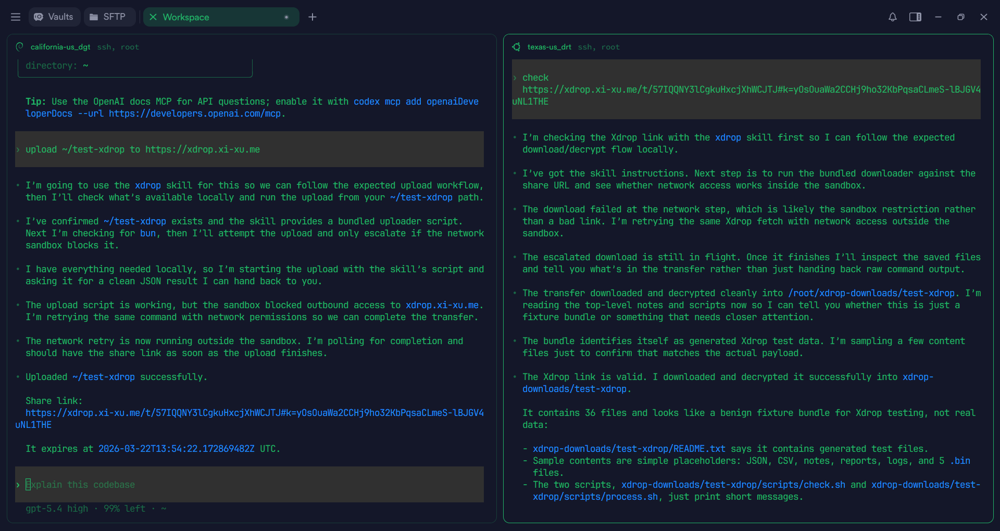
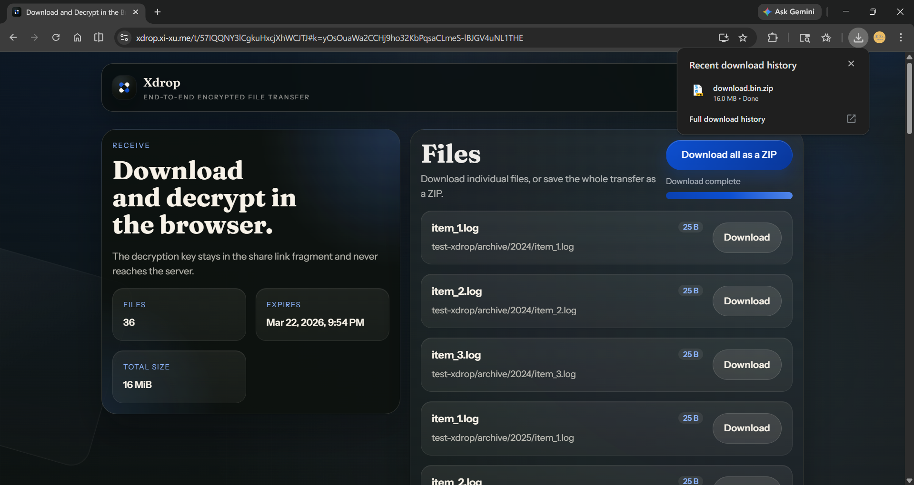
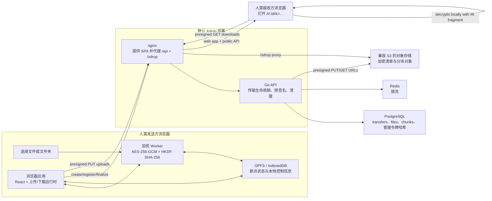

<p align="center">
  
</p>

<p align="center">
  <a href="https://codecov.io/github/xixu-me/xdrop">
    
  </a>
  <a href="https://github.com/xixu-me/xdrop/actions/workflows/ci.yml">
    
  </a>
  <a href="https://github.com/xixu-me/xdrop/actions/workflows/github-code-scanning/codeql">
    
  </a>
  <a href="https://ghcr.io/xixu-me/xdrop">
    
  </a>
</p>

<p align="center">
  <a href="./README.md">English</a> | 汉语
</p>

Xdrop 是一款面向人类与智能体的开源端到端加密文件传输应用，它能确保明文的文件名、文件内容以及密钥都不会留存在服务器上。

## 亮点

- 面向直接浏览器分享与智能体交接流程的端到端加密文件传输。
- 支持单文件和文件夹传输，接收文件夹时也可在本地重新打包为 ZIP 下载。
- Web 上传中断后可依赖本地暂存状态继续断点续传。
- 支持到期失效链接、发送方管理，以及上传后的可选隐私模式。
- 后端支持兼容 S3 的对象存储，并使用 PostgreSQL 和 Redis。

## 示例截图

<p align="center">
  
</p>

智能体可以直接加密和上传本地文件或文件夹并返回分享链接，也可以获得一个链接后做本地解密和下载。

<p align="center">
  
</p>

人类也可以直接在浏览器中打开分享链接，并在本地完成解密和下载。

## 通过智能体使用

智能体可以使用 Xdrop 上传文件，返回端到端加密的分享链接，并使用 Xdrop 链接进行本地解密。

安装配套的 skill：

```bash
bunx skills add xixu-me/skills -s xdrop
```

安装后，智能体可以直接在终端中使用 Xdrop 来：

- 上传本地文件或目录，并返回加密分享链接。
- 接收完整的 Xdrop 分享链接（包含 `#k=...`）后，在本地下载并解密文件。
- 将重复性的文件交接流程自动化，而不必依赖浏览器界面操作。

示例指令：

- `将 ./dist 上传到 https://xdrop.example.com，并给我一个 1 小时有效的 Xdrop 链接。`
- `在这台云服务器上将 /var/log/myapp 通过 Xdrop 发出来，我要在本地排查。`
- `将这个 Xdrop 链接下载到 ~/downloads，并保留原始目录结构。`

## 工作原理

对于基于浏览器的分享流程，核心生命周期如下。智能体会复用同一套加密传输格式和完整分享链接来完成终端上传与本地解密。

1. 发送方在浏览器中创建一次传输。Xdrop 会生成随机的传输根密钥和独立的链接密钥，可选地移除图片中可删除的元数据，并在上传开始前准备好可恢复的本地状态。
2. API 创建传输记录，并返回管理令牌和上传限制。浏览器先注册加密后的文件元数据，再分批请求分块上传所需的预签名 URL。PostgreSQL 保存传输、文件和分块元数据，Redis 负责限流，兼容 S3 的对象存储只保存密文对象。
3. 发送方分享完整链接，例如 `/t/:transferId#k=...`。其中 `#k=...` 片段只保留在浏览器端，用于在本地解开传输根密钥。
4. 上传过程中，文件分块会在独立的 Web Worker 中加密并流式写入存储。每上传完一个分块，浏览器都会加密清单文件、上传清单，并在最后使用封装后的根密钥完成传输。
5. 接收方打开链接后，会获取加密清单和分块 URL，并在浏览器中完成全部解密。文件夹下载时可以在本地重新打包成 ZIP。
6. 后台清理任务会定期从存储中删除已过期或已删除的传输对象。

Xdrop 不会让服务端接触到明文文件名、路径、内容或解密密钥。服务端仍然能看到运行层面的元数据，例如传输时间戳、文件数量、分块数量、文件大小，以及限流标识符。

关键技术细节：

- **加密模型：** 客户端会为传输根密钥和分享链接密钥各生成一个 32 字节随机密钥。随后使用 HKDF-SHA-256 派生出清单和每个文件各自的 AES-256-GCM 密钥，并在分块加密时将 `transferId`、`fileId`、`chunkIndex`、大小和协议版本作为认证附加数据绑定进去。
- **分块上传：** 服务端会向上传客户端声明分块大小、文件数限制和传输总大小限制。当前存储库默认使用 8 MiB 分块，最多 100 个文件，加密后的传输总大小上限为 256 MiB。
- **断点续传：** 当浏览器支持 OPFS 时，Xdrop 会将源文件持久化到本地；如果不可用，则在回退存储限制范围内使用基于 IndexedDB 的 Blob 存储。恢复上传时，客户端会先询问 API 哪些分块已存在，因此即使刷新页面或重新打开浏览器，也只会补传缺失的部分。
- **发送方控制：** 管理令牌只会在创建时返回一次，服务端保存的是它的 SHA-256 哈希。开启隐私模式后，发送方本地控制信息可在上传完成后被清除。
- **后端职责：** API 从不解密载荷。它负责校验传输状态、限制速率、签发预签名 URL、存储元数据，并清理已过期或已删除的对象。

## 系统架构

下图展示的是面向人类用户的浏览器流程。智能体会针对同一套 API 与分享链接格式执行终端上传和本地解密。



在默认的 Docker 部署中，nginx 会提供构建后的前端资源，同时代理 `/api` 和 `/xdrop`。如果 `S3_PUBLIC_ENDPOINT` 指向另一个公开可访问的对象存储端点，那么预签名上传和下载请求可以绕过 nginx 代理，其余架构保持不变。

## 部署

### 推荐的生产拓扑

面向公网部署时，建议将 Xdrop 放在 Caddy 或 nginx 之类的反向代理后面：

- 反向代理为你的公网域名终止 HTTPS。
- `xdrop` 容器只监听回环地址上的主机端口，例如 `127.0.0.1:8080`。
- 默认不建议公开暴露 MinIO。除非你有明确理由，否则应仅将 MinIO 端口绑定到 `127.0.0.1`。
- 将 `S3_PUBLIC_ENDPOINT` 和 `ALLOWED_ORIGINS` 设置为你的公开站点 URL，例如 `https://xdrop.example.com`。

### 第一步：获取文件

如果你只想运行已经发布的镜像，就不需要在服务器上克隆整个存储库。

下载部署所需文件：

```bash
mkdir -p xdrop/infra/minio
cd xdrop
curl -fsSL -o docker-compose.yml \
  https://github.com/xixu-me/xdrop/raw/refs/heads/main/docker-compose.yml
curl -fsSL -o infra/minio/init.sh \
  https://github.com/xixu-me/xdrop/raw/refs/heads/main/infra/minio/init.sh
chmod +x infra/minio/init.sh
```

你也可以额外下载 [`.env.example`](./.env.example) 作为支持配置项的参考：

```bash
curl -fsSL -o .env.example \
  https://github.com/xixu-me/xdrop/raw/refs/heads/main/.env.example
```

如果你打算自行构建镜像，请改为克隆存储库，以便 Docker 拿到完整的构建上下文。通常更推荐在 CI 或另一台机器上完成构建，再将最终镜像拉到服务器上部署。

### 第二步：检查配置

在服务器上安装 Docker 和 Docker Compose，然后检查 `docker-compose.yml` 中 `xdrop` 服务的环境变量。

至少需要将这些值替换成真实部署所用配置：

- `S3_PUBLIC_ENDPOINT`
- `ALLOWED_ORIGINS`

典型的生产配置如下：

```yaml
services:
  minio:
    ports:
      - '127.0.0.1:9000:9000'
      - '127.0.0.1:9001:9001'

  xdrop:
    ports:
      - '127.0.0.1:8080:80'
    environment:
      S3_PUBLIC_ENDPOINT: https://xdrop.example.com
      ALLOWED_ORIGINS: https://xdrop.example.com
```

请将 `.env.example` 视为支持配置项的参考清单。仅修改 `.env.example` 不会影响运行中的栈，因为存储库附带的 Compose 文件使用的是内联环境变量。

### 第三步：使用已发布镜像

```bash
docker compose up -d
```

该命令会使用 [`ghcr.io/xixu-me/xdrop:latest`](https://ghcr.io/xixu-me/xdrop)。

如果已发布镜像已经符合你的前端配置需求，这一步就足够了。

需要注意：

- `VITE_SITE_URL` 这类前端构建期变量会被直接烘焙进镜像。
- 如果你的部署使用不同的公网域名，并且你在意 canonical URL、Open Graph 元数据、JSON-LD 或 sitemap 生成，请不要直接使用已发布镜像，而应自行重建镜像。

### 第四步：可选，使用你自己的预构建镜像

```bash
XDROP_IMAGE=ghcr.io/your-org/xdrop:latest docker compose up -d
```

### 第五步：可选，自行构建镜像

当你需要不同的前端构建期配置时，请自行构建镜像：

```bash
git clone https://github.com/xixu-me/xdrop.git
cd xdrop
docker compose -f docker-compose.yml -f docker-compose.build.yml up -d --build
```

运行前请先修改 `docker-compose.build.yml` 中的构建参数。

例如：

```yaml
services:
  xdrop:
    build:
      args:
        VITE_SITE_URL: https://xdrop.example.com
        VITE_API_BASE_URL: /api/v1
```

在低内存服务器上直接构建可能会很慢甚至失败。这种情况下，建议在其他机器完成构建，将镜像推送到存储库后，再通过 `XDROP_IMAGE` 部署。

### 第六步：将 Xdrop 放到反向代理后面

`Caddyfile` 示例：

```caddyfile
xdrop.example.com {
  encode gzip zstd
  reverse_proxy 127.0.0.1:8080
}
```

然后重载 Caddy：

```bash
systemctl reload caddy
```

栈启动后，访问 `https://xdrop.example.com`。

### 生产环境说明

- 最终容器会用 nginx 提供构建后的前端，并在同一容器中运行 Go API。
- 整个栈包含 `xdrop`、`postgres`、`redis`、`minio` 以及初始化 bucket 的容器。
- 在默认单机部署中，MinIO 设计为私有服务。
- 公网流量通常只应访问反向代理暴露的 `80` 和 `443` 端口。

## 开发

### 前置要求

- Bun
- Go 1.26+
- Docker / Docker Compose

### 第一步：安装依赖

```bash
bun install --frozen-lockfile
```

### 第二步：启动基础服务

本地开发时，用 Docker 启动 PostgreSQL、Redis 和 MinIO：

```bash
docker compose up -d postgres redis minio minio-setup
```

### 第三步：运行 API

```bash
cd apps/api
go run ./cmd/api
```

### 第四步：运行 Web 应用

在第二个终端里，从存储库根目录执行：

```bash
bun run dev:web
```

打开 <http://localhost:5173>。本地开发时，Vite 开发服务器会代理：

- `/api` 到 <http://localhost:8080>
- `/xdrop` 到 <http://localhost:9000>

这样既能保留前端热更新，也能连接本地 Go API 和 MinIO。

## 测试

### Web

```bash
bun run lint:web
bun run typecheck:web
bun run test:web
bun run test:web:coverage
bun run build:web
```

### 端到端测试

如果还没安装 Playwright 浏览器，先执行一次：

```bash
bun run test:e2e:install
```

E2E 套件默认会访问 <http://localhost:8080> 上的 Xdrop，并在测试期间使用本地 Compose 启动的 `postgres` 和 `redis` 服务。请先启动完整栈：

```bash
docker compose -f docker-compose.yml -f docker-compose.build.yml up -d --build
```

然后运行测试：

```bash
bun run test:e2e
```

如果你想指向其他环境，请设置 `E2E_BASE_URL` 和 `E2E_API_URL`。

### API

在 `apps/api` 目录下执行：

```bash
go test ./... -coverprofile=coverage.out -covermode=atomic
```

部分 API 集成测试会使用基于 Docker 的 testcontainers。如果 Docker 不可用，这些测试会被跳过，覆盖率也会低于 CI。

### 格式化

```bash
bun run format
bun run format:check
```

## 项目结构

```text
apps/
  api/        Go API
    cmd/api/  API 入口
    internal/ 领域包
  web/        React 前端
    public/   静态资源
    src/      应用、组件、功能模块与工具代码
packages/
  shared/     共享 TypeScript 常量与辅助函数
    src/      共享源码
tests/
  e2e/        Playwright 端到端测试
infra/        部署与容器配置
scripts/      存储库自动化与辅助脚本
```

## 环境变量

完整列表请查看 [`.env.example`](./.env.example)。其中最重要的设置包括：

- `API_ADDR`
- `DATABASE_URL`
- `REDIS_ADDR`
- `S3_ENDPOINT`
- `S3_PUBLIC_ENDPOINT`
- `S3_BUCKET`
- `ALLOWED_ORIGINS`
- `VITE_API_BASE_URL`
- `VITE_SITE_URL`

## 许可证

AGPL-3.0-only。详见 [`LICENSE`](./LICENSE)。
